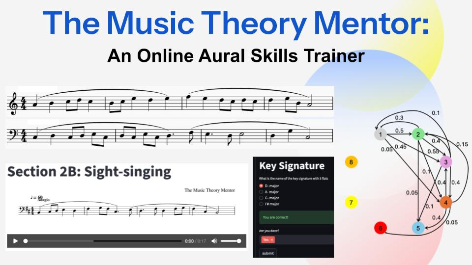

<!--
## Modeling the Impact of Pets on Household Happiness: An Economic Approach
-->

  

## Project Summary

The Music Theory Mentor (MT Mentor) is a web application that automatically generates practice problems for students studying music theory and preparing for the AP Music Theory exam. 

Although numerous resources exist for general music theory study, materials specifically designed for the AP Music Theory curriculum are severely limited. Unlike other AP subjects such as Calculus, Physics, and Economics, there is no dedicated AP Music Theory textbook, and only two books provide reliable, AP-aligned practice problems at the time of writing (2026).  Moreover, in 2025, the College Board restricted access to past exam questions, limiting their availability to only the most recent three years. As a result, students lack sufficient opportunities for hands-on training and systematic, repetition-based practice. 

MT Mentor addresses this issue by algorithmically generating unlimited practice problems with immediate feedback. Currently, it targets several types of problems that many students struggle with. By supporting repeated, hands-on practice, which is essential for mastering theoretical concepts, MT Mentor has the potential to lower barriers to success and improve learning outcomes for students preparing for the AP Music Theory exam.

This work was presented at [InnovArt 2026](https://innovart-hack.com/2026) and won [Honorable Mention](https://devpost.com/software/the-music-theory-mentor). 

